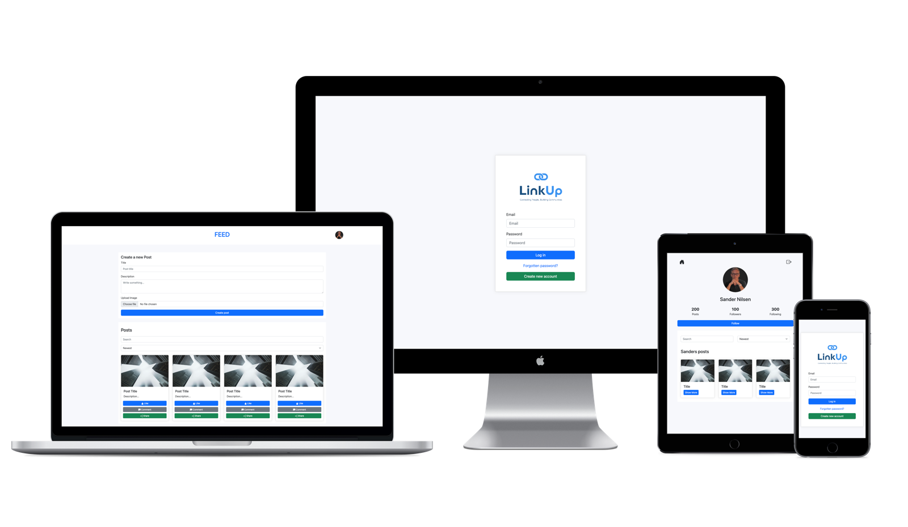

# Sander Nilsen — Portfolio

Personal portfolio showcasing selected projects from my Frontend Development studies at Noroff. Built with semantic HTML, modern CSS, and vanilla JavaScript with a focus on accessibility, responsive layouts, and smooth interactions.

Live site: https://sandernilsen.github.io/

## Badges

## Features
- Accessible layout and semantics: Landmark regions, ARIA labels, and reduced‑motion support.
- Project gallery with filters: Renders from a single data array, filterable by type (All/Web/App/Design).
- Smooth UX details: Smooth scrolling, active nav highlight, keyboard focus styles, and dynamic current year.
- Animated CV elements: Skill bars animate to their levels; work experience timeline expands/collapses.
- Responsive design: Scales from mobile to desktop with a clean, modern aesthetic.

## Tech Stack
- HTML5, CSS3 (custom properties, responsive grid)
- Vanilla JavaScript (no frameworks or build step)
- Font Awesome (icons via CDN)

## Project Structure
- `index.html` — Main page markup, sections for Hero, Projects, CV, and Footer.
- `css/styles.css` — Styles, theming (CSS variables), components, responsive rules.
- `main.js` — Interactivity: render projects, filtering, animations, nav behavior.
- `images/` — Thumbnails and profile image used in the UI.
- `site.webmanifest` and icons — Favicons and PWA manifest.

## Project Previews

Below are thumbnails of some featured projects linked from the portfolio:

  
  

  
  
  

## Getting Started
1) Clone or download the repository.
2) Open `index.html` directly in a browser, or serve locally for a better experience:
   - VS Code: use the “Live Server” extension.

No build step is required.

## Customization
- Edit projects: Update the `projects` array in `main.js` to add, remove, or modify items (title, type, tags, image, description, links). Types should match the filter chips (e.g., `web`, `app`, `design`).
- Update text content: Modify headings, intro, and quick facts in `index.html`.
- Adjust skills: In the CV section of `index.html`, change each skill’s label, percentage text, and the `--level` inline style (and `aria-valuenow`) to match your level.
- Images: Place preview images in `images/` and reference them from the project objects.

## Deployment
- GitHub Pages: Push to your `main`/`master` branch and configure the repository’s Pages settings to serve from the root.
- Netlify/Vercel: Drag‑and‑drop the folder or connect the repo; no build command needed.

## Accessibility Notes
- Uses semantic landmarks and ARIA attributes for navigation and controls.
- Respects `prefers-reduced-motion` and provides obvious focus states for keyboard navigation.
- Color contrast and button states are designed for clarity in both dark and light schemes.

## Contact
- LinkedIn: https://www.linkedin.com/in/sandernilsen/
- GitHub: https://github.com/SanderNilsen
